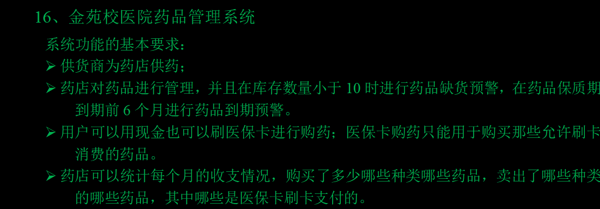

#Drug_Management_System-------药品管理系统 开发记录

（屎山是怎样炼成的）

django安装失败，换清华源------https://pypi.tuna.tsinghua.edu.cn/simple/

安装mysqlclient

新建app1-------------startapp app1

settings.py ---------
注册app1，链接新建Drug_Management_System数据库，改中文zh-hans

加入static目录-添加jquery3.7、bootstrap

编辑主导航母版，bootstrap的模板-----------main_nav

在views加入测试视图函数--------测试显示正常

重构视图放入views文件夹

网上抄了个登录页面-------似乎不太适配需要修改，已经为所有带有 .submit 类的元素（allButtons）添加了 click 事件监听器，但它们都调用了 getButtons 函数，该函数只是阻止了事件的默认行为（e.preventDefault()），但没有执行任何实际的提交操作。

考虑用Ajax提交 post。

算了，又读了一遍代码，发现这句没有用，注释掉了

借鉴一个bootstrap侧边栏-----https://v3.bootcss.com/examples/dashboard/#

放在main_sidebar

加入home地址当地址为空时跳转主页

创建药品库存表-----------

分析表构成：名称、单价、库存数量、生产日期、保质期、供货商（外码）、是否纳入医保卡（选择12）

创建供货商表-----------supplier

构成：供货商名称、地址

写一个drug list视图函数，还有add（没有检验），把之前写的util里的bootstrap，form复制过来---------

没写分页、搜索、检验、到期时间------先进行测试

修改数据表的几个bug-----测试显示、添加成功

为侧边栏用js添加了一个点击后active效果，用视图函数传的值，自己瞎想出来的，能跑就行

增加管理员列表视图，modelform写form里了，所有return重构为字典

美化药品入库form表单，添加bootstrap栅栏

写添加管理员页面--------没写验证

发现 添加时不显示错误信息----------------继续改bug

修好了，原来是打错字母了

复制之前写的md5加密 encrypt 到util目录

继续添加密码md5加密，加盐，和再次输入密码验证

增加删除功能

重构几个添加页面，使用公共模板-----public_add

复制了之前写的admin-edit 实现编辑功能

复制之前写的admin-reset--------运行正常

添加药品编辑删除功能

所有删除功能应该有一个警告弹窗，还没想好怎么写

写好了

新建中间件，在setting中注册

写对应的，登录逻辑（抄的）-----login.py

魔改登录页面适配form

改form继承的样式，还挺麻烦

完善下小细节----登录状态显示。。。

新建统计页面--------内容还没想好

出库表：订单号（时间+md5(...)），时间，名称，数量，总价，是否医保卡，方式：售出|损耗（过保质期）

还有问题，总价不应该在表里，这个药品因该还有售价和进货价。

添加供货商 ，完善所有功能（照搬admin）有点烧脑

添加出库记录add

下一步添加分页

做了一个医院logo

分页系统，用老师发的内个，因该进行改进，分页搜索应采用ajax传值

改进完成，没用ajax太难了，用传值传到输入框里解决。

计系统就比较费脑子了找时间再写

新增功能--------页码数超出判断

分页系统ok

添加出库记录后药品库存应相应减少

还因该加一个判断：不能使用医保卡购买的药不能用医保卡：是。出库

发现新bug，当搜索不到数据时直接报错了

修好了，分页新功能略有冲突，加一个判断就好了if page < 1 or page > total_page_count > 0:

又出bug  Unsupported lookup 'contains' for ForeignKey or join on the field not permitted.

外码搜索问题，一时半会解决不了，只能换个搜索键，搜索日期时间好了

分页系统ok都装上了

功能：不能医保卡购买的药不能用医保卡 完成

写了一个能否删除判断，drug和出库的判断

出事了，总价比我想得难计算，考虑用sql的触发器写

总价，太太太太难算了，我得算了，还是用触发器吧，牛角尖没时间钻了

DELIMITER $  
CREATE TRIGGER INSERT_total_price  
BEFORE INSERT  
ON app1_outorder  
FOR EACH ROW  
BEGIN  
    SET new.total_price = (SELECT price2 FROM app1_drug WHERE id = new.name_id) * new.quantity;  
END$  
DELIMITER ;
对于总的收入、支出还没想好如何计算
ok了
搞了个图表 chart js 装到本地还挺麻烦 npm install chart.js

https://chartjs.bootcss.com/docs/general/responsive.html

统计系统有雏形了，虽然一多半都是文心一言写的

https://juejin.cn/post/7108387199363743775

少一个判断逻辑，应区分损耗和销售
ok了

还缺一个触发器，drug，修改单价后，出库对应总价也要修改
ok

缺一个改价警告

新的触发器：
DELIMITER $    
CREATE TRIGGER UPDATE_outorder_total_price
AFTER UPDATE ON app1_drug  
FOR EACH ROW    
BEGIN    
    IF NEW.price2 != OLD.price2 THEN  
        UPDATE app1_outorder SET total_price = quantity * NEW.price2 WHERE name_id = NEW.id;  
    END IF;  
END$    
DELIMITER ;
inorder触发器
DELIMITER $  
CREATE TRIGGER INSERT_total_price2  
BEFORE INSERT  
ON app1_inorder  
FOR EACH ROW  
BEGIN  
    SET new.total_price = (SELECT price2 FROM app1_drug WHERE id = new.name_id) * new.quantity;  
END$  
DELIMITER ;
入库更新库存量
DELIMITER $  
CREATE TRIGGER update_storage  
AFTER INSERT 
ON app1_inorder
FOR EACH ROW  
BEGIN  
    UPDATE app1_drug SET `storage` = `storage`+new.quantity WHERE id=new.name_id;   
END$  
DELIMITER ;

医保支付占比、ok

按月支出，ok

收支对比折线图ok

添加了网站的ico图标

还需要一个触发器，新药入库后添加inordr对应记录

改了一下添加药品的逻辑，触发器好像实现不了，会出现循环，还有一些未知bug

少个日期显示的js

ok添加时间插件

又修了一堆bug，完成饼图数据处理
用sql实现每天检测一次：今天日期减去某个表的字段的日期，这个值如果小于此表的某个字段，则在另一个表（这个表同时每天清空一次）中加入新数据，数据是前一个表的“这个值”，和这一行对应的其他字段，还有一个字段是警告信息
可以直接用navcat的事件，还挺方便

发现新bug，关于入库保质期的逻辑错误，修改数据库。。。。。

完了
数据库又给我搞坏了
开修！
迁移文件都删了，改了一下数据库，因该修好了
确实修好了 ≡(▔﹏▔)≡

创建预警数据库------id，类型（太少，过期），inorder——id，剩余日期，drug——id， 剩余数量
放数据库里其实可以减少计算量

TRUNCATE TABLE app1_warnings
创建mysql，存储过程函数，但是这只是过期预警，还有库存预警
DELIMITER //  
  
CREATE PROCEDURE InsertWarnings()  
BEGIN  

TRUNCATE TABLE app1_warnings;
INSERT INTO app1_warnings (warning_type, time, in_id_id)  
SELECT   
    'time',  
    DATEDIFF(CURDATE(), production_date),  
    io.id  
FROM   
    app1_inorder io  
JOIN   
    app1_drug ad ON io.name_id = ad.id
WHERE   
    DATEDIFF(CURDATE(), io.production_date) < 30 * ad.quality_time;
END //  
  
DELIMITER ;

自动任务---------------CALL InsertWarnings()每天执行一次上述存储过程函数
再加一个（三个）触发器，更新inorder后也执行存储过程函数
算了删了，没用，而且会出bug，有冲突，垃圾sql
添加入库调用执行存储过程函数功能

++库存预警  存储过程函数完全体↓
BEGIN  

TRUNCATE TABLE app1_warnings;
INSERT INTO app1_warnings (warning_type, time, in_id_id)  
SELECT   
    'time',  
    DATEDIFF(CURDATE(), production_date),  
    io.id  
FROM   
    app1_inorder io  
JOIN   
    app1_drug ad ON io.name_id = ad.id
WHERE   
    DATEDIFF(CURDATE(), io.production_date) < 30 * ad.quality_time;
INSERT INTO app1_warnings (warning_type, count, drug_id_id)  
SELECT   
    'little',  
    io.`storage`,  
    io.id  
FROM   
    app1_drug io
WHERE   
    io.`storage` < 10;
END
添加了一个drug list删除警告
同时添加供货商删除警告

保质期倒计时预警，库存预警，警告弹窗
ok

修复登录界面，注册，加验证码
和登录界面的逻辑有冲突，只能用别的办法实现
勉强修好了

角色权限分配？
这个算了，没时间实现了

ajax弹窗添加数据？
这个也算了，没有必要

数据库历史密码？
好像没必要实现，这是数据库级用户的东西

重名校验？用户、药品 想写一个警告框
ok了

#添加药品分类？
#缺目前种类药品数量x饼图